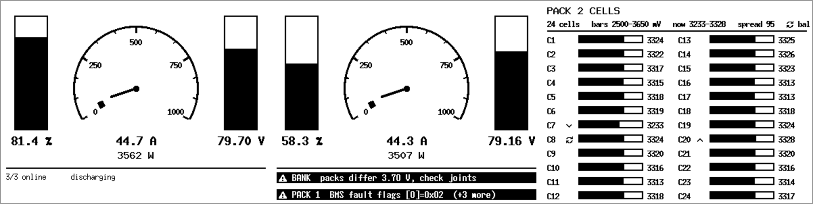
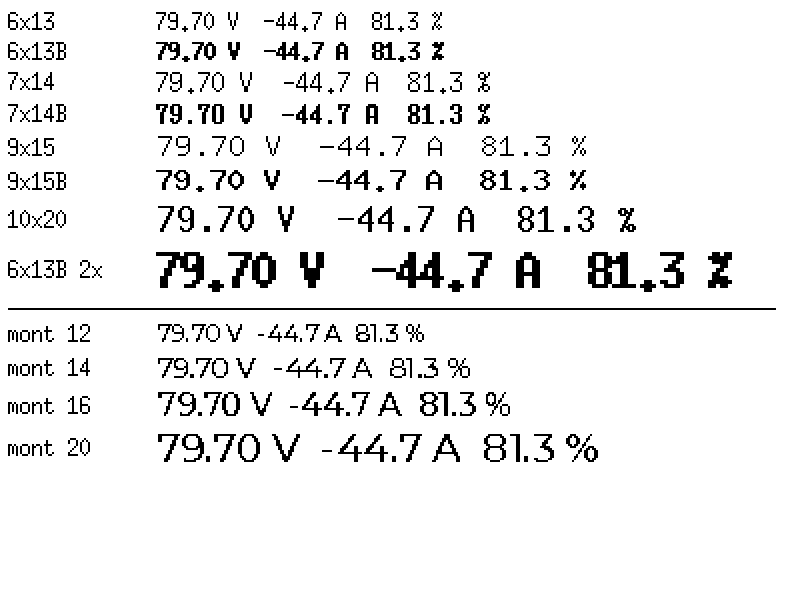

# lier_bms_scherm

A standalone display for three Daly BMS units running in parallel on one battery
bank. Polls all three over a shared CAN bus and shows state of charge,
charge/discharge current and per-cell health on a 4.2" reflective panel.

Hardware: **Waveshare ESP32-S3-RLCD-4.2** plus one **SN65HVD230** CAN
transceiver. Full specs, GPIO map and the wiring plan are in
[`docs/hardware/`](docs/hardware/).

## What it shows

| Page | Contents |
|---|---|
| **Overview** | Three bank instruments - a vertical SoC column, a 0-1000 A current dial with power beneath it, a vertical voltage column - over a two-line status footer |
| **Pack 1-3** | One BMS in full: a tall SoC column beside V/A/W, cell min/max, spread, temperatures, MOSFETs, cycles and state |
| **Cells** | All 24 cells in two columns of twelve, bars on the absolute 2.50-3.65 V cell range, with the min/max cells arrowed |



*Rendered by the host simulator at the panel's true resolution, 1 bit per pixel:
the overview, the same page with two alarms raised, and the cell detail of a
pack that has drifted.*

The current dial reads **magnitude only**, 0 to `UI_GAUGE_MAX_A` (1000 A), so the
whole sweep is available to the load rather than half of it. Direction is shown
by the `CHARGING` legend inside the dial and by the status line - not by which
way the needle leans - and the amps and watts beneath it are unsigned to match.

The overview's footer normally carries the online count, what the bank is doing,
and the button hint. When something is wrong, warnings displace those lines,
worst first. Warnings are set in bold and prefixed with a warning glyph; alarms
invert the whole row on top of that. The panel has no colour, so an inverted
band is the loudest cue available, and it survives being read at an angle in
poor light.

Warning rules live in `core/warnings.c`, not the UI, so they are unit-tested:
pack offline, parallel-pack voltage mismatch, cell count mismatch, implausible
cell readings, excessive spread, BMS fault flags, low SoC, over/under
temperature, and charging below freezing. Thresholds are `#define`s at the top
of `core/warnings.h` and assume a **24S LiFePO4 bank** - 60.0 V empty, 87.6 V
full, which is also the range of the voltage column (`UI_VBAR_CELLS` in
`ui/ui.h`).

The simulator draws black on white by default; set `SIM_REFLECTIVE_TINT` in
`port/sim/sdl_display.c` to preview the panel's real grey-green ground before
committing to anything that depends on fine contrast.

The screens are **400 x 300 landscape**. The glass scans natively as 300 x 400
portrait, so the device turns every pixel a quarter turn in `flush_cb`
(`BOARD_ROTATE_CW` in `port/esp32/main/board.c` - flip it at bring-up if the
picture comes out upside down). The simulator draws the landscape buffer
straight to the window, so both show the same picture.

## Fonts

The UI is set in **X11 misc-fixed** - the bitmap family behind u8g2's
`u8g2_font_6x13_tf`, which is what Waveshare's own U8g2 example for this board
draws with. On a 1 bpp panel a font *designed* at one bit beats any outline font
rasterised down to one: every stem is a whole pixel, so nothing is left to a
threshold decision. `SIM_FONT_SPECIMEN=1 ./build/sim` shows it against
Montserrat rendered at 1 bpp, which is what the UI used before:



The ladder is `UI_FONT_S`/`M`/`L`/`XL`/`XXL` in `ui/fonts/fonts.h` - 6x13, 7x14,
9x15, 10x20, and 6x13 bold doubled for the one oversized `NO DATA` alert.
Everything below XL has a real bold cut, which is what carries warning
emphasis.

Regenerate with `tools/make-fonts.sh`, which needs `xfonts-base` installed.
misc-fixed ships as PCF and `lv_font_conv` is built on opentype.js, so it
rejects the format outright (*Unsupported OpenType signature fcp*); the fonts go
through `tools/pcf_to_lvgl.py` instead, which reads the strike through FreeType
and emits the same table `lv_font_conv` would. The `LV_SYMBOL_*` glyphs have no
bitmap equivalent and are merged in from FontAwesome, thresholded.

Because the fonts are monospaced, "does this string fit its column" is
arithmetic rather than a guess. `ui/page_pack.c` states its per-column character
budget and checks the widest possible value against it with `UI_STATIC_ASSERT`,
so a reworded string fails the build instead of quietly overlapping its
neighbour.

The panel has no touch layer of its own. Navigation is **two capacitive pads** -
copper tape behind the front panel, read by the SoC's touch peripheral, so the
enclosure needs no opening. One cycles pages, the other opens and closes the cell
detail. The onboard KEY button still works too, with a short press and an 800 ms
hold, which keeps the board usable on the bench before the pads are fitted.

A pack that stops answering is drawn as `NO DATA` and drops out of the bank
totals - it never shows stale numbers that look current.

## Layout

```
core/        portable C99: Daly frame decoding, the data model, the poll
             scheduler. No platform headers, no I/O, no threads - which is what
             makes it testable on the laptop and identical on the device.
ui/          LVGL 9 screens. Reads the model, draws it. Shared verbatim
             between the simulator and the firmware.
port/sim/    host: SocketCAN + SDL, rendering LVGL's 1-bit output
port/esp32/  device: ESP-IDF app - TWAI, ST7305 panel, KEY button
tools/       daly_sim.py, a fake three-BMS bus; vcan setup
tests/       host unit tests over core/
docs/hardware/  board spec, transceiver, Daly protocol, wiring plan
```

[docs/core-design.md](docs/core-design.md) is the reasoning behind `core/`: why
it has no platform dependencies, how the four modules relate, the multi-frame
commit rule, and which numbers are still unverified guesses about Daly's
protocol.

## Building and running on the laptop

Everything except the panel driver runs on the host, against a virtual CAN bus.

```bash
sudo apt install build-essential cmake ninja-build libsdl2-dev can-utils

python3 -m venv .venv
.venv/bin/pip install -r tools/requirements.txt

./tools/setup-vcan.sh              # creates and brings up vcan0

cmake -S . -B build -G Ninja       # fetches LVGL 9.5.0 on first configure
cmake --build build
ctest --test-dir build --output-on-failure
```

Then, in two terminals:

```bash
.venv/bin/python tools/daly_sim.py --scenario weak-cell
./build/sim vcan0
```

Keys in the simulator window: `n` = next page, `N` = cell detail, `q` = quit.
On the device those are the two touch pads, or a short press and an 800 ms hold
of the KEY button - `ui_input()` does not care which produced the event.

The simulator renders at 1 bit per pixel in the panel's own colours, so it is an
honest preview rather than a flattering mockup.

### Other host tools

```bash
./build/sim_headless vcan0         # same core, printed as text - no LVGL
./build/test_core                  # unit tests standalone
candump vcan0                      # watch the raw bus
```

### Simulator scenarios

| Scenario | What it exercises |
|---|---|
| `normal` | three healthy packs discharging |
| `weak-cell` | pack 2 has a cell drifting 120 mV low - check the cell page finds it |
| `offline` | pack 3 stops answering for 20 s - check `NO DATA` and the bank totals |
| `charging` | current reverses sign, SoC rising |
| `alarm` | pack 1 raises an alarm flag |
| `faults` | several at once - enough to overflow the footer and show the `+N more` count |
| `winch` | standby broken by pulls ramping the bank to ~600 A, driving the gauge over its range |

`--drop 0.15` randomly discards replies, which exercises the multi-frame
reassembly. Losing a frame must cost one poll round, never a half-written cell
array.

`daly_sim.py` goes through python-can, so the same simulator drives a real
adapter for bench-testing the ESP32 before any BMS is wired up:

```bash
.venv/bin/python tools/daly_sim.py -I slcan -i /dev/ttyACM0 -b 250000
```

### Unattended screenshots

```bash
SIM_SCRIPT="3000:n,1500:n,1500:N" SIM_SHOT_DIR=shots SIM_QUIT_MS=12000 \
  ./build/sim vcan0
```

Writes a PPM of the visible 300x400 area after each scripted key press.

### Real CAN hardware

Both host binaries take the interface as their first argument, so a USB-CAN
adapter replaces `vcan0` with no rebuild:

```bash
./build/sim_headless can0 --raw    # every frame, with our decode alongside
./build/sim_headless can0          # the decoded model, twice a second
./build/sim can0                   # the actual screens
```

`--raw` also drops the socket filter, so a pack answering with an identifier we
did not predict is visible rather than silently absent. Start there.

**IXXAT USB-to-CAN V2** (and the rest of that family) needs an out-of-tree
driver: it is **not in the mainline kernel** - the patches are still in review -
and nothing in `drivers/net/can/usb/` claims USB vendor `08d8`. HMS publish the
SocketCAN driver themselves, and `tools/setup-ixxat.sh` builds and installs it:

```bash
sudo ./tools/setup-ixxat.sh        # optional bitrate argument, default 250000
```

It clones <https://github.com/hms-networks/ixxat-socketcan-usb> to
`/usr/local/src`, builds against the running kernel, installs, and brings `can0`
up at 250 kbit/s. Idempotent - re-run it after a kernel upgrade. It installs
`dkms` first if it is missing, because without DKMS the module is copied into
place by hand and quietly stops existing at the next kernel update.

**With Secure Boot on, there is a one-time extra step.** DKMS signs the module
with a key it generates at `/var/lib/shim-signed/mok/MOK.der`, and a newly
generated key is not yet trusted by the firmware, so the kernel refuses it:

```
Loading of module with unavailable key is rejected
```

That message says nothing about signing, which is the confusing part. Enrol the
key once:

```bash
sudo mokutil --import /var/lib/shim-signed/mok/MOK.der   # invent a password
sudo reboot
```

A blue **MOK Manager** screen appears before the OS loads: *Enroll MOK* ->
*Continue* -> *Yes* -> the password you just invented -> *Reboot*. The password
is used at that screen and never again; it is not your login password. Then
re-run `setup-ixxat.sh`. Later kernel updates rebuild through DKMS and sign with
the same, now-trusted key, so it does not come back.

(The alternative - turning Secure Boot off in firmware, or
`sudo mokutil --disable-validation` - works too, and weakens the machine for
every other module as well.)

For adapters that *are* supported in mainline, none of that applies:

```bash
# gs_usb / candleLight / PCAN - appears as a netdev on its own
sudo ip link set can0 type can bitrate 250000 && sudo ip link set up can0

# slcan (CANable in slcan firmware, USBtin) - -s5 is 250 kbit/s
sudo slcand -o -c -s5 /dev/ttyACM0 can0 && sudo ip link set up can0
```

`ip -details -statistics link show can0` is the first thing to check whenever
the bus looks dead: it carries the error counters, and a bench setup with one
terminator or the wrong bit rate shows up there before anywhere else.

The full procedure for first contact with real packs - addressing, termination,
validating the decode table - is in
[`docs/hardware/bring-up-usb-can.md`](docs/hardware/bring-up-usb-can.md).

## Building for the board

```bash
sudo apt install -y flex bison          # the only prerequisites likely missing

mkdir -p ~/esp && cd ~/esp
git clone -b v5.5.5 --depth 1 --recursive https://github.com/espressif/esp-idf.git
cd ~/esp/esp-idf && ./install.sh esp32s3
. ~/esp/esp-idf/export.sh                # needed in every new shell
```

Then, from anywhere:

```bash
idf.py -C port/esp32 set-target esp32s3
idf.py -C port/esp32 build
idf.py -C port/esp32 flash monitor
```

Use `-C` rather than `cd port/esp32`: the repository root holds the *host* CMake
project, and `idf.py` run from there will try to build that instead.

**Not ESP-IDF 6.x.** v6.0 replaced the classic `driver/twai.h` API with a
node-based one (`esp_twai_onchip.h`); `port/esp32/main/twai_link.c` is written
against the 5.x API. `idf.py --version` must report 5.x.

### Flashing

One USB-C cable does both: the console is the built-in USB serial/JTAG
(`CONFIG_ESP_CONSOLE_USB_SERIAL_JTAG`), not UART0, which stays free on the
expansion header. The board enumerates as `/dev/ttyACM0`.

| | |
|---|---|
| Nothing at `/dev/ttyACM*` | Force download mode: hold **BOOT**, click **PWR**, release BOOT. There is no reset button - BOOT, KEY and PWR only, and PWR is a power latch (click on, long press off) |
| `Permission denied` on the port | You are not in `dialout`: `sudo usermod -aG dialout $USER`, then log out and back in |
| Flash succeeds, board does not run | `idf.py -C port/esp32 erase-flash`, then flash again |
| Wrong port picked | `idf.py -C port/esp32 -p /dev/ttyACM0 flash monitor` |

`idf.py monitor` decodes a `Guru Meditation` backtrace to source lines
automatically, so keep it attached rather than reading raw addresses. Ctrl-] to
exit.

Expect **bus-off log spam** until a CAN transceiver is wired - nothing ACKs the
poller's frames, so the controller errors out and the 2 s health check recovers
it every few seconds. That loop is correct behaviour, not a fault.

[`docs/hardware/bring-up-board.md`](docs/hardware/bring-up-board.md) is the
first-flash procedure: which log lines to expect in order, and what each way the
panel can fail points at.

### Display driver

`port/esp32/main/st7305.c` is our own, and two components that look like they
would fit are deliberately not used:

| Component | Why not |
|---|---|
| `leazer/esp_lcd_st7305` | Not an `esp_lcd` panel driver despite the name - a standalone driver with its own SPI device, hardcoded for a 2.9" 168x384 panel. There is no `esp_lcd_new_panel_st7305()`. |
| `espressif/esp_lvgl_port` | Its monochrome mode packs to **SSD1306 page format** - `base + width*(y/8) + x`, bit `y%8`, i.e. 8 *vertical* pixels per byte. The ST7305 wants 4-wide x 2-tall blocks, so the output would be scrambled. |

So `board.c` drives LVGL directly. LVGL renders **RGB565** and both ports reduce
it to one bit with the same `ui_px_is_paper()` function in `ui/ui.h`, so the
simulator window shows the same quantisation the glass will - anti-aliased edges
land on the same side of the threshold in both. LVGL is pinned to **9.5.0 on
both sides** so the two cannot drift.

The ST7305 does not use a linear framebuffer: **each byte holds a 4-wide x
2-tall block of pixels**, giving a 15000-byte buffer for 300x400. `flush_cb`
places pixels individually through `st7305_set_pixel()`. The register sequence
came from Waveshare's own `09_LVGL_V9_Test` example and agrees with the Zephyr
board devicetree on every value.

> **The display driver has never run.** It compiles, and its constants are
> cross-checked against two independent sources, but no board has existed to
> test it on. Expect to debug it at bring-up. Everything else - the decoder, the
> model, the poller, the UI - is exercised by the host tests and the simulator.
>
> [`docs/hardware/bring-up-board.md`](docs/hardware/bring-up-board.md) is the
> first-flash procedure: which log lines to check in order, and what each way
> the panel can fail points at.

### Threading

Two tasks, one lock.

| Task | Core | Prio | Does |
|---|---|---|---|
| `app_main` | 0 | 1 | CAN poll + receive, button, bus health, pushes the model into the UI |
| `LVGL` | 1 | 2 | `lv_timer_handler()` - rendering and the SPI flush to the panel |

A repaint is ~120000 pixel conversions plus a 15 kB SPI transfer. Running that
on the poll loop would stall CAN servicing long enough for packs to be marked
`NO DATA` for no reason, so it gets its own task on the other core. Core 0 stays
free for `app_main` and, later, the Wi-Fi stack.

Everything touching LVGL goes through `board_lvgl_lock()` /
`board_lvgl_unlock()` (`port/esp32/main/board.c`). The mutex is **recursive**,
so nesting locks in a call chain cannot deadlock against itself.

Two rules the main loop follows, both there to protect the CAN timing:

- **Never wait indefinitely for the lock.** `app_main` uses a 20 ms timeout and
  simply retries on the next pass, a couple of milliseconds later. Blocking
  would trade a late repaint for missed CAN frames, which is the wrong way
  round.
- **A dropped lock must never lose a button press.** The board has one control;
  a press that vanishes reads as a dead button. So presses are *latched*
  (`input_pending`) and retried until the lock is taken. For the same reason
  `last_ui` only advances after an update actually happened.

`ui_init()` runs before `board_lvgl_start()`, while no other task exists yet -
the only unlocked LVGL call in the program.

`core/` is deliberately outside all of this. It touches no LVGL state, so the
decoder, model and poller need no lock and stay testable on the host.

**Adding a task that draws** - a Wi-Fi dashboard, say - needs nothing new: take
the lock around the `ui_*()` calls, keep it off the read-only model access, and
do not hold it across anything slow.

### First contact with real hardware

Build the raw frame logger first (`idf.py -C port/esp32 menuconfig` -> Daly BMS
monitor -> raw CAN frame logger). It skips the display entirely and dumps every
frame over USB serial. The Daly field layouts are reconstructed from community
reverse-engineering, not a vendor datasheet: check them against Daly's own app
and correct `core/daly_proto.c` before trusting anything on screen. The full
sequence is in [`docs/hardware/wiring.md`](docs/hardware/wiring.md#bring-up-order).

Faster, and what to do first: skip the board entirely and put a USB-CAN adapter
on the laptop. `./build/sim_headless can0` runs the same decoder and the same
poll schedule with a two-second rebuild instead of a flash cycle - see
[`docs/hardware/bring-up-usb-can.md`](docs/hardware/bring-up-usb-can.md).

## Wiring, in one paragraph

One SN65HVD230 on the 2x8 expansion header: **3V3 to P1 pin 1, GND to pin 3, CAN
TX to pin 13 (GPIO17), CAN RX to pin 11 (GPIO3)** - pins 7 and 9 belong to the
touch pads. CANH/CANL as a twisted pair to
the three Daly units, with a ground wire alongside. 250 kbit/s, 29-bit extended
frames, and **exactly two 120 ohm terminators at the two physical ends of the
bus** - these breakouts ship with one fitted, so lift it on every node that is
not an end. The assembled unpowered bus should measure about 60 ohm across
CANH-CANL. Set the three BMS board numbers to 0x01/0x02/0x03 with Daly's Windows
BmsMonitor tool first; they all default to 0x01 and will collide otherwise.

Full detail, including the safety note about laptop ground and pack negative, is
in [`docs/hardware/wiring.md`](docs/hardware/wiring.md).
