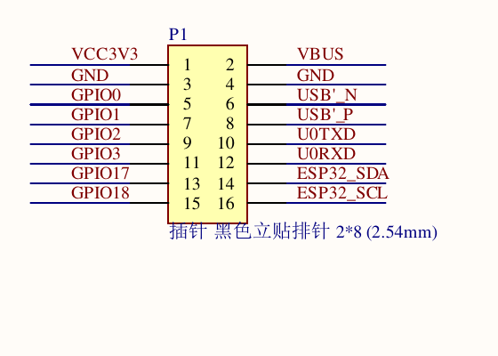

# Waveshare ESP32-S3-RLCD-4.2

The compute + display board. Waveshare SKU **33507** (`ESP32-S3-RLCD-4.2-EN`,
the variant with the English-market packaging); SKU 33298 is the same board.
Sold on Amazon under the reseller brand **UeeKKoo**, ASIN `B0GLPHR1ZX`.

- Vendor docs: <https://docs.waveshare.com/ESP32-S3-RLCD-4.2>
- Product page: <https://www.waveshare.com/esp32-s3-rlcd-4.2.htm>
- Demo code: <https://github.com/waveshareteam/ESP32-S3-RLCD-4.2>
- Zephyr board port (best pin reference):
  <https://github.com/zephyrproject-rtos/zephyr/tree/main/boards/waveshare/esp32s3_rlcd_4_2>

## Compute

| | |
|---|---|
| Module | ESP32-S3-WROOM-1-**N16R8** |
| CPU | Xtensa 32-bit LX7 dual-core, up to 240 MHz |
| SRAM | 512 KB |
| ROM | 384 KB |
| PSRAM | **8 MB, octal** (this is why GPIO33-37 are unavailable) |
| Flash | 16 MB |
| Radio | Wi-Fi 2.4 GHz + Bluetooth 5 (LE), onboard antenna |
| USB | USB-C, for flashing and log output |

## Display

| | |
|---|---|
| Type | 4.2" **fully reflective LCD (RLCD)** - no backlight, reads like e-paper |
| Resolution | **300 x 400** (portrait native) |
| Colour | Monochrome, 1 bit per pixel |
| Controller | **ST7305 / ST7306** (Sitronix), 4-wire SPI, write-only |
| Interface | SPI up to ~10 MHz (`mipi-max-frequency = 10000000` in the Zephyr dts) |
| Touch | **None** - the pads this project uses are copper tape on GPIO1/GPIO2, not part of the panel |

Panel window geometry, from the Zephyr devicetree: `width = 312`, `height = 400`,
`start-column = 204`, `inversion-on`. The visible area is 300 x 400 portrait; the
312 is the controller's column granularity.

Design consequences: no animation, no gradients, no fine hairlines. Heavy
black-on-white type, solid bars, redraw on change at about 1 Hz.

## Onboard peripherals

- **ES8311** low-power audio codec + **ES7210** ADC (echo cancellation)
- Dual microphone array; speaker on an MX1.25 2-pin header (amp enable on GPIO46)
- **SHTC3** temperature + humidity sensor (I2C `0x70`)
- **PCF85063A** RTC (I2C `0x51`), with a PH1.0 rechargeable backup battery header
- TF (microSD) card slot, FAT32, 1-bit SDMMC
- 18650 lithium holder with charge/discharge management; CHG and WRN indicator LEDs
- Battery voltage sense on GPIO4 via a divider (100k / 200k, so ratio 1:3)
- Buttons: **BOOT** (GPIO0), **KEY** (GPIO18, free for application use), **PWR**
  (hardware power latch: long press off, click on)
- **Reserved 2 x 8 female header, 2.54 mm pitch** - the expansion point

## GPIO map

Sourced from the Zephyr board devicetree and Waveshare's own ESPHome tutorial.
Those two agree independently, so confidence is high.

| GPIO | Function |
|---|---|
| 0 | BOOT button (active low, pull-up) |
| 4 | Battery voltage ADC (ADC1 ch3, 100k/200k divider) |
| 5 | LCD D/C |
| 8 | I2S DIN (microphone) |
| 9 | I2S BCLK |
| 10 | I2S DOUT (speaker) |
| 11 | LCD SPI CLK (SPI2) |
| 12 | LCD SPI MOSI (SPI2) |
| 13 | I2C SDA (RTC, SHTC3) |
| 14 | I2C SCL |
| 15 | RTC interrupt (active low, pull-up) |
| 16 | I2S MCLK |
| 18 | **KEY button** (active low, pull-up) - free for the application |
| 19, 20 | USB D-, D+ |
| 21 | SD CMD |
| 26-32 | SPI flash - **unusable** |
| 33-37 | Octal PSRAM - **unusable** on the N16R8 module |
| 38 | SD CLK |
| 39 | SD DATA0 |
| 40 | LCD CS |
| 41 | LCD RESET |
| 43 | UART0 TX |
| 44 | UART0 RX |
| 45 | I2S LRCLK |
| 46 | Speaker amplifier enable (high = amp on) |

> **Careful:** the community page `kylehase/ESPHome-ST7305-RLCD` lists the LCD as
> CLK=GPIO39 / MOSI=GPIO38. Those are the **SD card** pins. The LCD is on 11/12.

### The 2 x 8 expansion header (P1)

Resolved from the schematic PDF. This is the only place external hardware can be
attached, so it also defines which GPIOs are actually reachable.



| Pin | Signal | | Pin | Signal |
|---|---|---|---|---|
| 1 | **VCC3V3** | | 2 | VBUS (USB 5 V) |
| 3 | **GND** | | 4 | GND |
| 5 | GPIO0 (BOOT strap) | | 6 | USB'_N |
| 7 | **GPIO1** | | 8 | USB'_P |
| 9 | **GPIO2** | | 10 | U0TXD (GPIO43) |
| 11 | GPIO3 (JTAG strap) | | 12 | U0RXD (GPIO44) |
| 13 | **GPIO17** | | 14 | ESP32_SDA (GPIO13) |
| 15 | GPIO18 (KEY button) | | 16 | ESP32_SCL (GPIO14) |

**Freely usable GPIOs on the header: GPIO1, GPIO2, GPIO17**, plus GPIO3 at a
pinch - it is the JTAG source-select strap, but that function only exists once
the `JTAG_SEL_ENABLE` eFuse is burned, which it is not from the factory. GPIO0 is
the BOOT strap and GPIO18 already drives the KEY button.

All four are now in use: GPIO1 and GPIO2 are capacitive touch pads (the touch
channels are tied to GPIO1..GPIO14 in silicon, so they cannot go anywhere else),
and CAN takes GPIO17 and GPIO3, TWAI being free to route anywhere through the
GPIO matrix.

The other unused GPIOs on the SoC (6, 7, 42, 47, 48) are **not brought out** - they
terminate at the module and are unreachable without soldering to the module itself.

This board therefore has exactly four usable expansion pins, and the project
uses all four: two for CAN and two for touch. Nothing is spare.

## Development frameworks

Waveshare supports **ESP-IDF** and **Arduino IDE**. This project uses ESP-IDF v5.5.

The only managed component this project pulls in is `lvgl/lvgl`, pinned to
**9.5.0** so host and device cannot drift, and configured with
**`LV_COLOR_DEPTH 16`** - not 1. LVGL renders RGB565 and `board.c` reduces each
pixel to one bit in `flush_cb`, using the same `ui_px_is_paper()` the host
simulator uses, so the two quantise identically.

Two components that look like they would fit are deliberately **not** used; see
`port/esp32/main/idf_component.yml` for the full reasoning:

| Component | Why not |
|---|---|
| `leazer/esp_lcd_st7305` | Not an `esp_lcd` panel driver despite the name - standalone, with its own SPI device, hardcoded for a 2.9" 168x384 panel |
| `espressif/esp_lvgl_port` | Its monochrome mode packs to SSD1306 page format (8 vertical pixels per byte); the ST7305 wants 4-wide x 2-tall blocks, so the output would be scrambled |

## Handling warnings (from Waveshare)

The screen is a fragile precision component. Do not use it as a stress point when
plugging in USB-C or fitting/removing an 18650. Cracking or display faults from
rough handling are not covered by warranty.

## Panel memory layout (ST7305)

The controller does **not** use a linear framebuffer. Each byte holds a
**4-wide x 2-tall block of pixels**:

```
byte index = (y / 2) * 75 + (x / 4)          75 = 300 / 4 bytes per row-pair
bit        = 7 - ((x % 4) * 2 + (y % 2))     MSB first
buffer     = 75 * 200 = 15000 bytes          200 = 400 / 2 row-pairs
```

Addressing follows from that: each column address covers 12 pixels (3 bytes of
4), so 300 px = 25 columns, `CASET 0x12..0x2A`. Each page is a row pair, so
400 px = 200 pages, `RASET 0x00..0xC7`. The `0x12` start offset is this panel's
placement inside the controller's larger addressable area - what the Zephyr
devicetree calls `start-column`.

This is why no generic `esp_lcd` panel driver can drive it, and why
`port/esp32/main/st7305.c` exists. Waveshare's own example builds two 360 kB
lookup tables for the mapping; the formulas above are four shifts, so we compute
it inline instead.

### Init sequence provenance

The register values in `st7305.c` come from Waveshare's
`02_Example/ESP-IDF/09_LVGL_V9_Test/components/port_bsp/display_bsp.cpp` and
agree with the Zephyr board devicetree on every one:

| Register | Value | Zephyr property |
|---|---|---|
| `0xD6` NVM load | `17 02` | `nvm-load` |
| `0xC0` gate voltage | `11 04` | `gate-voltages` |
| `0xC1` VSHP | `69 69 69 69` | `vsh` |
| `0xC2` VSLP | `19 19 19 19` | `vsl` |
| `0xC4` VSHN | `4B 4B 4B 4B` | `vshn` |
| `0xC5` VSLN | `19 19 19 19` | `vsln` |
| `0xD8` oscillator | `80 E9` | `osc-settings` |
| `0xB2` frame rate | `02` | `framerate` |
| `0xB0` duty | `64` | `multiplex-ratio` |
| `0x36` MADCTL | `48` | `remap-value` |
| `0xB8` panel | `29` | `panel-settings` |
| `0xB3` gate waveform HPM | `E5 F6 05 46 77 77 77 77 76 45` | `hpm-gate-waveform` |
| `0xB4` gate waveform LPM | `05 46 77 77 77 77 76 45` | `lpm-gate-waveform` |
| `0x21` | inversion on | `inversion-on` |

Both sources agree on every value, and `st7305.c` runs with them on the
reference board.
